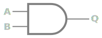
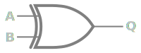
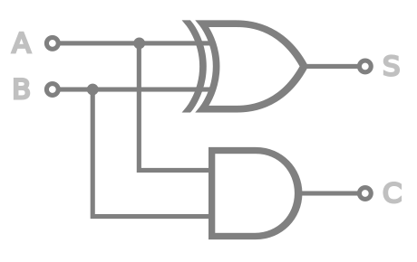

# Как научить электричество считать?

Мы научились хранить информацию с помощью электричества, и это довольно скучно...
Как же с ней работать? Какие операции были бы нам полезны?

Попробуем реализовать простейшую математическую операцию *сложения*.

Мы хотим собрать электрическую схему с двумя входами (2 двоичных числа) и
двумя выходами (поразрядный результат).

| A   | B   | A + B  |
| --- | --- | ------ |
| $0$ | $0$ | $00_2$ |
| $0$ | $1$ | $01_2$ | | $1$ | $0$ | $01_2$ |
| $1$ | $1$ | $11_2$ |

Для реализации такой схемы необходимо познакомиться с основными логическими операциями

## Логические операции

### "И"

| A | B | A ⋅ B |
| - | - | ----- |
| 0 | 0 | 0     |
| 0 | 1 | 0     |
| 1 | 0 | 0     |
| 1 | 1 | 1     |

Такой элемент можно реализовать, например, в виде **последовательного** соединения
замкнутых или разомкнутых ключей в соответствии со входными сигналами
(0 - разомкнут, 1 - замкнут)

### "ИЛИ"

| A | B | A + B |
| - | - | ----- |
| 0 | 0 | 0     |
| 0 | 1 | 1     |
| 1 | 0 | 1     |
| 1 | 1 | 1     |

В данном случае ключи будут соединены **параллельно**.

### "Исключающее ИЛИ"

| A | B | A ⊕ B |
| - | - | ----- |
| 0 | 0 | 0     |
| 0 | 1 | 1     |
| 1 | 0 | 1     |
| 1 | 1 | 0     |

## Полусумматор

- **A** - первое слагаемое
- **B** - второе слагаемое
- **S** (*sum*) - сумма разряда
- **C** (*carry*) - перенос в следующий разряд

## Выводы

- Мы заставили электрический ток решать математическую задачу сложения чисел.
- С помощью электроники можно выполнять условную логику (*if-else statements*).
